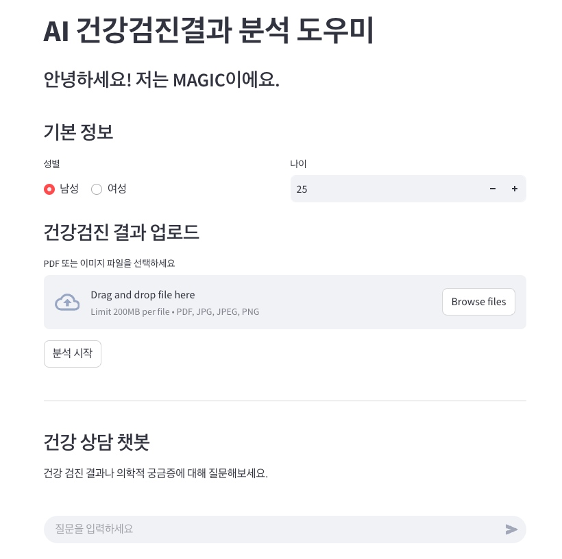

# 🛠️ [AI 건강검진결과 분석 도우미 - MAGIC]

### 📌 개요
이 프로젝트는 AGI Agent Application Hackathon의 일환으로 개발되었습니다. 사용자의 건강검진 결과에 대해 친근한 설명과 건강 팁을 제공하는 것을 목표로 합니다.

### 🚀 주요 기능
- ✅ **Information Extraction**: Upstage의 OCR 및 information extraction 기능을 사용하여 업로드된 이미지에서 주요 정보를 추출하고 JSON 형식으로 변환합니다.

  - 주요 항목:
    - 신체 측정: 키, 체중, BMI, 허리둘레
    - 혈액 검사: 혈압, 헤모글로빈, 공복 혈당, 콜레스테롤, 중성지방 등
    - 기타 검사 결과: 간 기능, 신장 기능, 흉부 X-ray 소견 등

- ✅ **로딩 중 건강 팁 제공**: 이미지에서 주요 정보를 추출하는 과정에 시간이 소요됩니다. 작업이 완료되기까지 기다리는 동안, 사용자에게 유용한 건강 지식을 제공합니다.

- ✅ **친근한 설명**: 추출된 건강검진 결과를 바탕으로 Upstage SOLAR를 사용하여 사용자 친화적인 요약 문구를 생성합니다. 복잡한 의학 용어를 피하고 일상적인 언어를 사용하여 환자에게 정서적 지원도 함께 제공하는 설명을 제공합니다.

- ✅ **병원/클리닉 추천**: 사용자의 건강검진 결과를 바탕으로 적절한 진료과/전문과를 추천하고, 사용자 주변의 병원을 검색하여 안내합니다.

- ✅ **추가 Q&A**: 사용자가 추가적인 건강 관련 질문(예: "고혈압을 어떻게 관리할 수 있을까요?")을 할 때, RAG 아키텍처를 사용하여 사용자의 건강검진 결과와 전문적인 건강 정보 데이터베이스를 참조하여 챗봇 형식으로 개인화된 답변을 제공합니다.

### 🖼️ 데모 스크린샷

  

### 🧩 기술 스택
- **Upstage API**
- **LangChain**
- **Streamlit**

### 🏗️ 프로젝트 구조
```
📁 AGI_AGENT_HACKATHON_2025-MAGIC/
├── data/ # 앱 구동 및 RAG에 필요한 각종 데이터 경로
├── sample_data/ # 테스트를 위한 샘플 데이터
├── main.py # 앰 구동을 위한 메인 모듈들 코드
├── rag_based_query_system.py # RAGE 기반 Q&A를 위한 모듈 코드
├── UI.py # 유저 화면 설계
├── README.md
├── requirements.txt
```

### 🔧 설치 및 실행 방법

```bash
# 리포지토리 복제
git clone https://github.com/UpstageAI/cookbook/usecase/agi-agent-application/AGI_AGENT_HACKATHON_2025-MAGIC.git
cd <repository_directory> # 디렉토리 경로

# 필요 패키지 설치
pip install -r requirements.txt # Python == 3.12

# .env 파일 생성 (MAC)
echo "API_KEY = '<your Upstage API KEY>'" > .env
echo "GOOGLE_MAPS_API_KEY = '<your Google Maps API KEY>'" >> .env

# .env 파일 생성 (Window)
chcp # 현재 코드페이지 확인
chcp 65001 # 65001(UTF-8)이 아닌 경우
echo "API_KEY = '<your Upstage API KEY>'" > .env
echo "GOOGLE_MAPS_API_KEY = '<your Google Maps API KEY>'" >> .env
chcp <기존 코드> # (선택) 기존 코드페이지로 복원

# streamlit 실행
streamlit run UI.py
```

### 📁 사용 데이터셋 및 참고 자료
- [전국 병의원 및 약국 현황](http://opendata.hira.or.kr/op/opc/selectOpenData.do?sno=11925)
- [일반인을 위한 만성콩팥병 바로알기(3종)](https://www.kdca.go.kr/board/board.es?mid=a20503050000&bid=0021&tag=&act=view&list_no=143371)
- [간질환 바로 알기](https://www.kasl.org/bbs/?number=6028&mode=view&code=general_pamphlet&keyfield=&keyword=&category=&gubun=&orderfield=)
- [한국인 간질환 백서 (개정판): 2023년 업데이트](https://www.kasl.org/bbs/?number=5499&mode=view&code=ency&keyfield=&keyword=&category=&gubun=&orderfield=)
- [나와 가족을 위한 고혈압 예방과 관리 정보](https://www.guideline.or.kr/chronic/view.php?number=88)
- [나와 가족을 위한 당뇨병 예방과 관리 정보](https://www.guideline.or.kr/chronic/view.php?number=89)
- [나와 가족을 위한 이상지질혈증 예방과 관리 정보](https://www.guideline.or.kr/chronic/view.php?number=90)

### 🙌 팀원

| 이름        | 역할               | GitHub                             |
|-------------|--------------------|------------------------------------|
| 송지우     | PM, LLM 파이프라인 개발 | [@jiuisdisciple](https://github.com/jiuisdisciple) |
| 김한재  | UI, 백엔드 개발, 코드 병합  | [@ONEASH](https://github.com/oneash98) |
| 한연재  | LLM 파이프라인 개발, 프롬프트 엔지니어링  | [@yeonjaehan](https://github.com/yeonjaehan) |
| 박승현  | 데이터 준비, 프롬프트 엔지니어링  | [@bluutaco](https://github.com/bluutaco) |

### ⏰ 개발 기간
- 마지막 업데이트: 2025-04-04

### 📄 License
This project is licensed under the [MIT license](https://opensource.org/licenses/MIT).  
See the LICENSE file for more details.

### 💬 Additional Notes